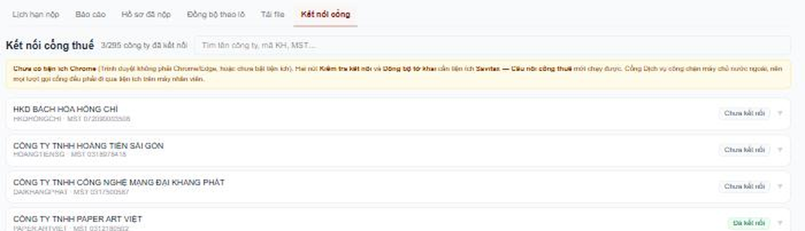
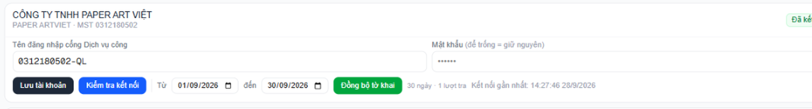
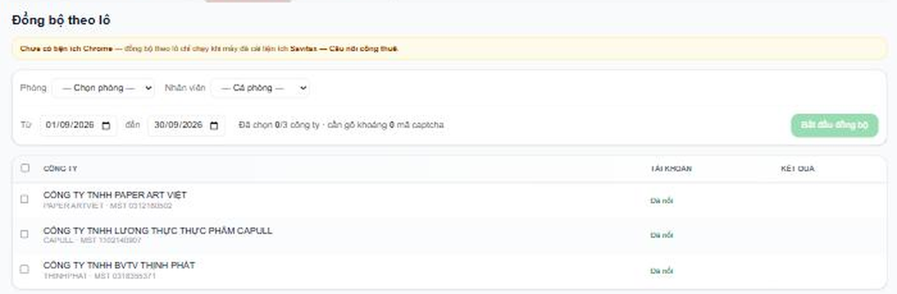
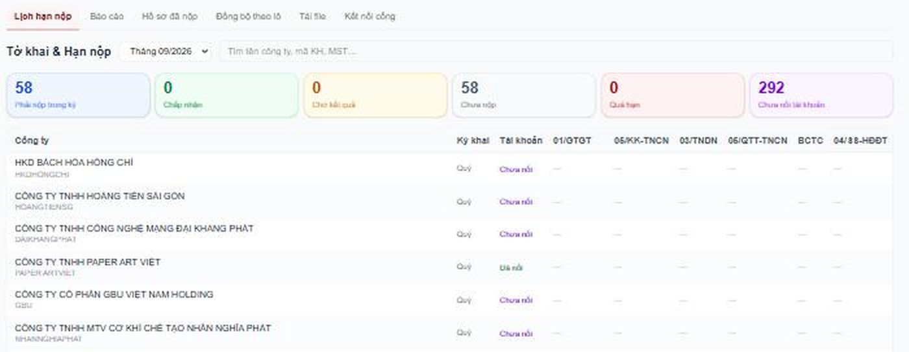
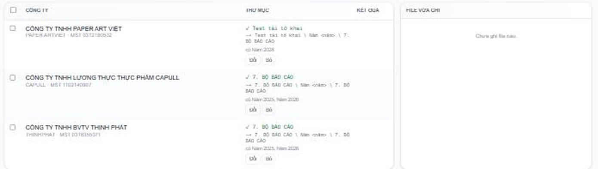
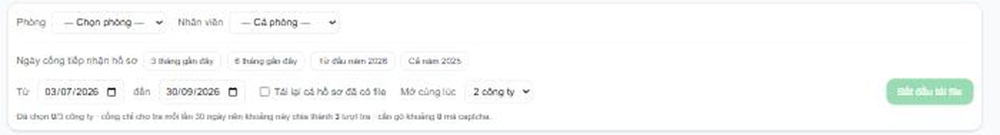

# Phân hệ Tờ khai — Hướng dẫn cho nhân viên

Phân hệ này thay việc **mở cổng Dịch vụ công, tra tay từng công ty, tải từng file, đổi tên, bỏ vào
thư mục**. App làm hết trừ một việc: **gõ mã captcha** — cái đó máy không làm thay được, và cũng
không nên làm thay.

Ba phần: [cài tiện ích](#phần-1--cài-tiện-ích-chrome) · [cách dùng](#phần-2--cách-dùng) ·
[lưu ý](#phần-3--lưu-ý-quan-trọng).

---

## Phần 1 — Cài tiện ích Chrome

### Vì sao phải cài

Máy chủ của Savitax đặt ở Singapore. Cổng Dịch vụ công thuế **chặn mọi kết nối từ nước ngoài**, nên
máy chủ gọi thẳng vào cổng là không tới. Máy của nhân viên ở Việt Nam thì gọi bình thường.

Tiện ích chỉ làm đúng một việc: **chuyển tiếp yêu cầu** giữa trang Savitax và cổng thuế. Nó không
tự chạy nền, không thu thập gì, không đọc trang nào khác.

### Cài (5 phút, làm một lần)

1. Chép cả thư mục `chrome-extension` về máy. Gợi ý để ở `C:\Savitax\chrome-extension`. Đừng để
   trong Downloads hay Desktop tạm — dễ bị xoá nhầm.
2. Mở Chrome → gõ vào thanh địa chỉ: `chrome://extensions`
3. Bật **Chế độ dành cho nhà phát triển** (Developer mode) — công tắc góc trên bên phải.
4. Bấm **Tải tiện ích đã giải nén** (Load unpacked) → chọn thư mục vừa chép.
5. **Đối chiếu mã tiện ích** hiện dưới tên. Phải đúng chuỗi này:

   ```
   affcgkipcpdjoiednghajbahjanhlnnn
   ```

   Khác một ký tự là chọn sai thư mục — dừng lại, làm lại bước 4.

Xong. Vào màn hình Tờ khai, các nút sẽ nhận ra tiện ích.

### Cập nhật bản mới

Chép đè thư mục cũ → vào `chrome://extensions` → bấm nút **Tải lại** (mũi tên vòng) ở ô tiện ích.
Mã không đổi nên không phải làm gì thêm.

### Trình duyệt nào dùng được

**Chrome hoặc Edge trên máy tính.** Firefox, Safari, điện thoại, máy tính bảng đều không chạy được
phần tải file — chúng không có khả năng ghi thẳng vào thư mục trên ổ đĩa.

---

## Phần 2 — Cách dùng

Vào menu **Tờ khai & Hạn nộp**. Bên trong có 6 tab:

| Tab | Trả lời câu hỏi gì |
|---|---|
| **Lịch hạn nộp** | App *nghĩ* công ty phải nộp những gì trong kỳ này |
| **Báo cáo** | Phòng nào, ai còn tồn đọng |
| **Hồ sơ đã nộp** | Cổng thuế *thật sự* đã nhận những gì |
| **Đồng bộ theo lô** | Kéo trạng thái mới về cho nhiều công ty một lượt |
| **Tải file** | Tải tờ khai + thông báo về thư mục công ty trên ổ chung |
| **Kết nối cổng** | Khai tài khoản cổng thuế của từng công ty |

Phân biệt hai tab hay bị nhầm: **Lịch hạn nộp** là *dự kiến* do app tự sinh theo loại hình công ty;
**Hồ sơ đã nộp** là *sự thật* lấy từ cổng. Số liệu hai bên lệch nhau là chuyện bình thường và chính
là thứ cần soi.

### Bước 1 — Khai tài khoản cổng thuế (tab Kết nối cổng)

Làm một lần cho mỗi công ty.



1. Tìm công ty → bấm vào dòng công ty để mở ra.
2. **Tên đăng nhập cổng Dịch vụ công**: dạng `0312180502-QL` (mã số thuế kèm đuôi `-QL`).
3. **Mật khẩu**: mật khẩu cổng thuế của công ty. Sửa lại sau này thì **để trống = giữ nguyên**.
4. Bấm **Lưu tài khoản**.
5. Bấm **Kiểm tra kết nối** → app hiện ảnh captcha phóng to → gõ mã → Enter.



Trạng thái sau khi kiểm:

- **Đã kết nối** (xanh) — xong, dùng được.
- **Sai mật khẩu** (đỏ) — hỏi lại khách, **đừng thử đi thử lại**. Xem [lưu ý về khoá tài khoản](#2-sai-mật-khẩu-thì-dừng-lại-ngay).
- **Chưa kết nối** (xám) — chưa kiểm lần nào.

Mật khẩu được mã hoá trước khi lưu vào cơ sở dữ liệu. Không ai đọc được bằng cách xem thẳng dữ liệu.

### Bước 2 — Kéo hồ sơ từ cổng về

**Một công ty:** ở tab Kết nối cổng, chọn khoảng **Từ … đến …** rồi bấm **Đồng bộ tờ khai**.

**Nhiều công ty:** dùng tab **Đồng bộ theo lô** — đây là cách nên dùng.



1. Chọn **Phòng** và **Nhân viên** (để trống = cả phòng).
2. Tick các công ty, hoặc bấm **Chọn hết … công ty**.
3. Chọn khoảng ngày.
4. Bấm **Bắt đầu đồng bộ**.
5. App hiện captcha từng công ty một, gõ mã rồi Enter, nó tự chuyển sang công ty kế tiếp.

Màn hình báo trước **cần gõ khoảng bao nhiêu mã** — mỗi công ty tốn 2 mã. 20 công ty ≈ 40 mã.

Hai nút khi đang chạy:

- **Dừng sau công ty này** — làm nốt công ty đang dở rồi nghỉ.
- **Bỏ qua công ty này** — gặp công ty hỏng thì nhảy qua, không chặn cả lô.

> **Khoảng ngày là NGÀY CỔNG TIẾP NHẬN, không phải kỳ tính thuế.** Tờ khai quý 1 nộp vào tháng 4, nên
> muốn lấy tờ khai quý 1 thì khoảng ngày phải phủ tháng 4. Chọn nhầm là tra ra rỗng mà không hiểu vì sao.

Cổng chỉ cho tra từng cửa sổ 30 ngày, app tự cắt khoảng dài thành nhiều lượt và giãn 2,5 giây mỗi
lượt. Khoảng quá 12 lượt (trên ~1 năm) thì màn hình cảnh báo — cổng sẽ chặn.

### Bước 3 — Xem kết quả

**Tab Hồ sơ đã nộp** — mỗi công ty một dòng tóm tắt, bấm để bung ra từng hồ sơ. Có lọc và phân trang.

**Tab Lịch hạn nộp** — ma trận công ty × loại tờ khai, kèm 6 ô tổng:



| Ô | Nghĩa |
|---|---|
| **Phải nộp trong kỳ** | Tổng số việc app sinh ra cho kỳ này |
| **Chấp nhận** | Cổng đã chấp nhận — xong hẳn |
| **Chờ kết quả** | Cổng đã tiếp nhận, chưa ra kết quả |
| **Chưa nộp** | Chưa thấy hồ sơ, còn trong hạn |
| **Quá hạn** | Chưa thấy hồ sơ, đã qua hạn — **việc cần làm ngay** |
| **Chưa nối tài khoản** | Chưa khai tài khoản cổng nên app không biết gì cả |

Ô "Chưa nối tài khoản" cao không có nghĩa là công ty chưa nộp — chỉ nghĩa là **app đang mù**.

**Tab Báo cáo** — sổ xuống ba cấp ngay tại chỗ: phòng → nhân viên → công ty. Trưởng phòng bung
phòng mình ra là thấy ai còn tồn.

### Bước 4 — Tải file về thư mục công ty (tab Tải file)

#### Trỏ thư mục (làm một lần cho mỗi công ty)

Ở cột **Thư mục** của từng công ty, bấm **Chọn thư mục** rồi trỏ vào **thư mục gốc của công ty đó**
trên ổ chung — ví dụ:

```
G:\Shared drives\...\Huỳnh Thị Mỹ Lệ\3.THỊNH PHÁT
```

**Trỏ vào thư mục công ty, không trỏ vào thư mục con.** App tự đi tiếp xuống:

```
3.THỊNH PHÁT\2. HỒ SƠ KẾ TOÁN\Năm 2026\7. BỘ BÁO CÁO\
```

Không có tầng `2. HỒ SƠ KẾ TOÁN` thì app tạo `Năm <năm>` ngay trong thư mục đã trỏ, và có cảnh báo
để mình biết mà chọn lại. Màn hình luôn **hiện trước đường dẫn file sẽ rơi vào** — nhìn dòng đó
trước khi bấm chạy.



Trình duyệt nhớ thư mục, lần sau không phải chọn lại. Thỉnh thoảng nó hỏi lại quyền ghi — lúc đó ô
thư mục hiện nút **Cấp lại quyền**, bấm một cái là xong.

#### Chạy tải



1. Chọn phòng / nhân viên, tick công ty.
2. Chọn khoảng **Ngày cổng tiếp nhận hồ sơ** — có nút nhanh: 3 tháng, 6 tháng, từ đầu năm, cả năm ngoái.
3. **Mở cùng lúc**: 1–4 công ty. Để mặc định **2**.
4. Bấm **Bắt đầu tải file** → gõ captcha khi app hỏi.

Trong lúc công ty A đang tải, app đã xin mã cho công ty B — nên gõ liên tục, gõ xong là rảnh, máy tự
tải nền.

Tick **Tải lại cả hồ sơ đã có file** chỉ dùng khi cần lấy lại file đã tải (file hỏng, xoá nhầm).
Bình thường để trống, app tự bỏ qua hồ sơ đã có.

#### File rơi vào đâu

Mỗi kỳ là **một thư mục ngang hàng**, mở thư mục nào cũng cùng một bố cục:

```
7. BỘ BÁO CÁO\
   BAOCAOTHUE_Q2_2026_VANLANG\             ← chính thức
      TỜ KHAI THUẾ\        TK_GTGT_Q2.2026_VANLANG.xml
      THÔNG BÁO CHẤP NHẬN\ TBCN_GTGT_Q2.2026_VANLANG.xml
      BẢNG KÊ\             (app không ghi gì, để mình tự bỏ vào)
   BAOCAOTHUE_Q2_2026_VANLANG_BSL1\        ← bổ sung lần 1
   BAOCAOTHUE_Q2_2026_VANLANG_BSL2\        ← bổ sung lần 2
   BỘ BÁO CÁO TÀI CHÍNH_2025_VANLANG\      ← báo cáo tài chính năm
   BỘ BÁO CÁO TÀI CHÍNH_2025_VANLANG_BSL1\
```

Quy tắc tên file:

- `TK_` = tờ khai · `TBTN_` = thông báo **tiếp nhận** · `TBCN_` = thông báo **chấp nhận**
- Rồi tới sắc thuế (`GTGT`, `TNCN`, `TNDN`, `BCTC`), kỳ, năm, mã khách hàng
- `_BSL1`, `_BSL2` = bổ sung lần 1, lần 2 — **tên file cũng mang dấu này**, không chỉ tên thư mục,
  để chép file ra chỗ khác vẫn biết là bản nào

---

## Phần 3 — Lưu ý quan trọng

### 1. Chậm là cố ý

App gọi cổng thuế đúng **một lượt mỗi ~2,2 giây**, dù mở bao nhiêu công ty cùng lúc. Mở nhiều là để
**người** khỏi ngồi chờ, không phải để máy chạy nhanh hơn.

Đây là lựa chọn có chủ đích: **bị cổng thuế chặn thì cả phòng đứng việc**, còn chậm hơn vài phút thì
không ai chết. Đừng tìm cách ép nhanh hơn.

### 2. Sai mật khẩu thì DỪNG LẠI NGAY

Cổng khoá tài khoản sau vài lần đăng nhập sai. **Khoá tài khoản cổng thuế của khách là sự cố thật**
— khách không nộp được tờ khai, và mình là người gây ra.

App đã tự bảo vệ: gặp báo sai mật khẩu là **dừng hẳn, không thử lại lần nào**. Phần còn lại là việc
của người: thấy trạng thái **Sai mật khẩu** thì đi hỏi khách, **đừng bấm thử lại**.

Gõ **sai captcha thì không sao** — cổng kiểm captcha trước khi kiểm mật khẩu, nên gõ sai chỉ mất
công gõ lại, không tính là lần đăng nhập sai.

### 3. Captcha khó đọc — gõ chậm còn hơn gõ sai

Ảnh captcha của cổng rất bé, app đã phóng to ~2,5 lần. Hai cặp dễ nhầm nhất:

- **số 0 ↔ chữ o**
- **số 1 ↔ chữ l**

### 4. Không nhập khoảng ngày quá dài

Cổng chỉ tra từng cửa sổ 30 ngày. Khoảng càng dài càng nhiều lượt, quá ~1 năm là cổng chặn. Cần dữ
liệu cũ thì chia làm nhiều lần, đừng quét một phát cả 3 năm.

### 5. Mỗi công ty một thư mục riêng — kiểm trước khi chạy

Trỏ nhầm thư mục là **file của công ty này rơi vào thư mục công ty khác**. App có cảnh báo khi phát
hiện hai công ty trỏ trùng một thư mục, nhưng nó chỉ **cảnh báo chứ không chặn** — quyết định vẫn là
của mình.

Trước khi bấm chạy, nhìn dòng đường dẫn mẫu màn hình hiện ra.

### 6. Công ty chưa có Mã khách hàng thì không tải được

Tên file dựng từ mã khách hàng. Thiếu mã thì app không đặt được tên, nên chặn từ đầu và liệt kê công
ty nào thiếu. Bổ sung mã trong hồ sơ công ty rồi quay lại.

### 7. App lưu file XML gốc, không tự in ra PDF

File `.xml` là **bản gốc cổng thuế phát ra**, có giá trị đối chiếu. Cần bản in cho khách thì vẫn mở
HTKK in như cũ.

(Phần app tự dựng PDF đang tắt — bản in ra chưa chuẩn, đang chờ nghiên cứu thêm. Bật ẩu ra tờ giấy
sai nội dung pháp lý còn tệ hơn không có.)

### 8. HTKK không mở được file trên Google Drive

HTKK là phần mềm cũ, không đọc nổi đường dẫn có dấu tiếng Việt trên ổ mạng. **Chép file ra ổ D rồi
mở là chạy bình thường.** Đây là hạn chế của HTKK, không phải lỗi app — tên thư mục app đặt giống
hệt tên nhân viên vẫn đặt tay lâu nay.

### 9. Một tài khoản, một phiên

Cổng chỉ cho mỗi tài khoản đăng nhập một phiên. **Đang chạy đồng bộ thì đừng mở cổng Dịch vụ công
bằng tay cùng lúc với công ty đó** — mở là một trong hai bên bị đá ra giữa chừng.

### 10. Đóng tab là mất việc đang chạy

Phần tải file chạy ngay trong trình duyệt. Đóng tab hoặc tắt máy giữa chừng thì việc dừng. File đã
tải xong vẫn còn nguyên, chạy lại app tự bỏ qua những hồ sơ đã có.

---

## Gặp trục trặc

| Hiện tượng | Xử lý |
|---|---|
| **"Chưa có tiện ích Chrome"** | Chưa cài, hoặc cài rồi mà đang tắt. Vào `chrome://extensions` kiểm tra công tắc và đối chiếu mã tiện ích |
| **"Trình duyệt này không ghi được vào thư mục"** | Đang dùng Firefox/Safari/điện thoại. Chuyển sang Chrome hoặc Edge trên máy tính |
| **Ô thư mục báo "cần cấp lại quyền ghi"** | Bấm **Cấp lại quyền**. Chrome hỏi lại quyền sau một thời gian là bình thường |
| **Tra ra rỗng mà chắc chắn đã nộp** | Khoảng ngày là **ngày cổng tiếp nhận**, không phải kỳ tính thuế. Nới khoảng ra |
| **Cổng báo lỗi liên tục** | Nghỉ 5–10 phút rồi làm lại. Gọi dồn quá nhanh là cổng chặn tạm |
| **Trạng thái "Sai mật khẩu"** | Hỏi khách mật khẩu mới. **Đừng bấm thử lại** |
| **Tra được tờ khai nộp trước 01/07/2025?** | Không. Cổng Dịch vụ công ghi rõ hồ sơ nộp **trước 01/07/2025** nằm ở cổng Thuế điện tử cũ, phải tra tay bên đó |

---

*Cập nhật 30/09/2026. Phân hệ đang chạy thử, chưa mở cho toàn phòng.*
